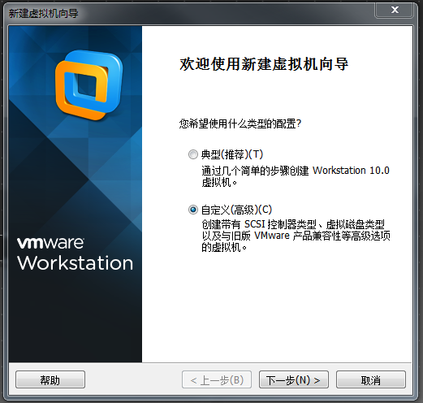
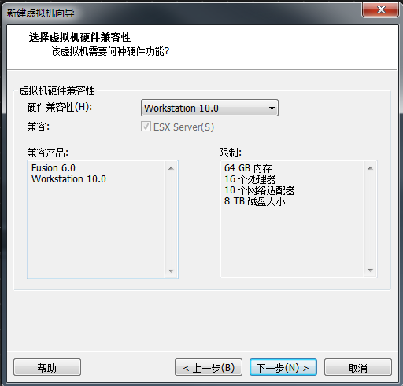
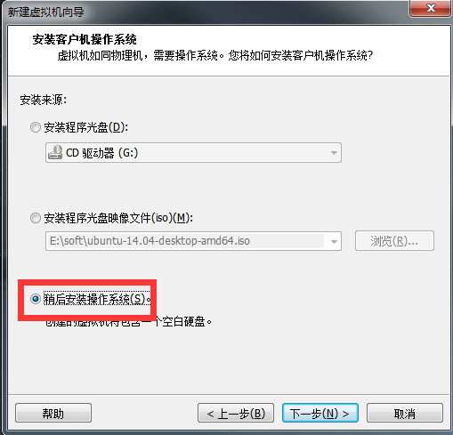
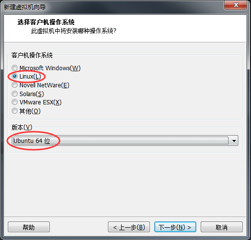
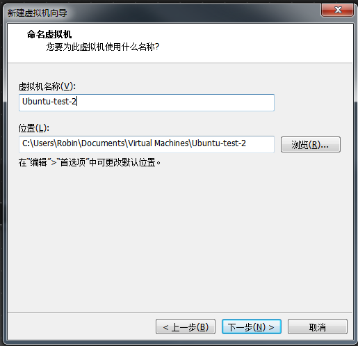
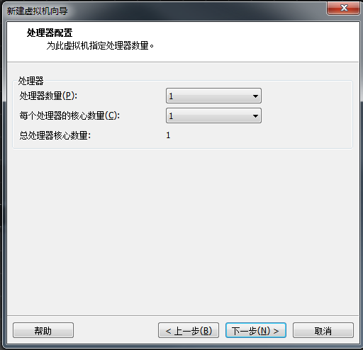
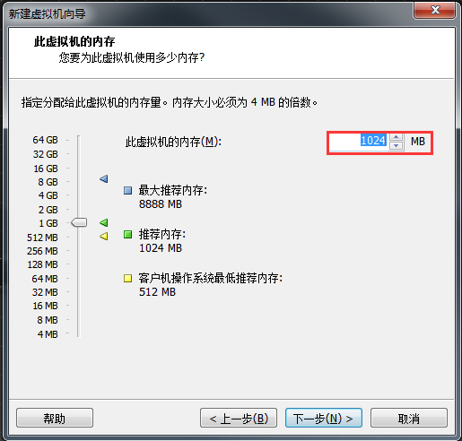
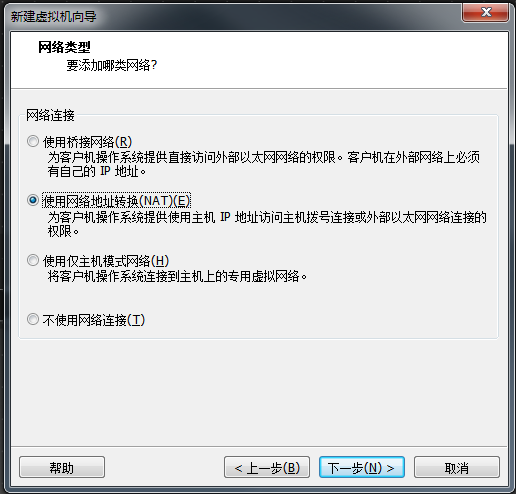

### Ubuntu系统安装

如果你是新手，那么还是建议你使用虚拟机来进行学习会方便很多，因此，本文还主要是介绍一下虚拟机下如何安装Ubuntu（其它发行版本安装方法类似，例如CentOS）

- 需要准备的东西
  - `VMware workstation`，这是一款虚拟机软件，当然也有其它产品可以替代，比如`Virtual Box`，不过我觉得还是VMware更好用一点，需要注册才能使用，所以你需要自己再找到相应版本的注册机，如果懒得上网找的话，请跳到本文最后我给出的共享链接进行下载（带注册机哦）； 
  - `系统镜像`，这是个什么鬼？就像windows一样，要装系统的时候需要有一个以`iso`结尾的镜像文件才能装系统 

  好了，使用虚拟机的话，有以上两样东西就足够了，下面开始安装吧

- 安装步骤（多图预警）
  - 先安装VMware（虚拟机软件） 

    > 这里可能有些人会把虚拟机和我们常说的在虚拟机里装系统混淆，虚拟机只是一个软件，而我们要安装的系统指的是要在虚拟机这个软件里运行的系统，所以虚拟机和我们讲的Linux系统其实是两个东西 

    这个就是下载下来以后傻瓜式安装就可以了，此处不再花篇幅赘述

  - 创建虚拟机
    - 打开VMware
    - 选择左上角 文件-> 新建虚拟机，或者使用快捷键Ctrl + N，然后会弹出“新建虚拟机向导”界面 

    - 选择自定义虚拟机
     

     

    - 此处选“稍后安装操作系统
     

    - 如果你安装的是CentOS或者Redhat，版本请选择Redhat
     

    - 虚拟机名称可以随便写
     

    - 处理器配置都默认即可
     

    - 内存一般至少512MB
     

    - 网络类型也默认即可
     

     

     

     

     

     

  - 挂载镜像文件

  - 开始装系统

- 下载链接
  - [VMware及注册机](http://pan.baidu.com/s/1qWBX7qc)
  - 系统镜像 