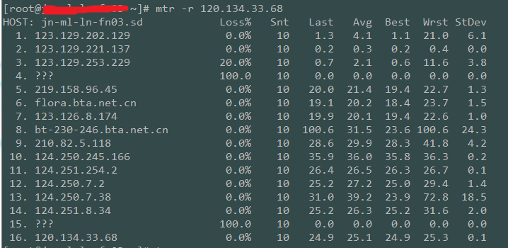

###Linux几个常用网络诊断工具

在运维工作中，通常会遇到很多网络问题，此时，一些定位网络问题的工具显得尤为重要，下面就将介绍一下我所常用的几个工具和使用场景
 - **ping**
   ping命令是一条最基础的测试本机到目的ip连通性的工具，如下图，不带任何参数的ping命令默认每秒发送一个数据包，并返回结果，按下CTRL+C结束，而如果使用-f参数则可以快速不断发送icmp数据包，可以通过-f参数查看大概的丢包率
   ping命令返回结果中可以看到总共发送了多少个包，有多少个包被成功接收，丢包率是多少，ping的总共时长是多少等等
   
   
 - **traceroute**
   使用traceroute命令可以看到发送的数据包从起点到终点都经过了哪些路由，traceroute相比ping命令来说有一个优点就是可以看到数据包在每一跳或者说经过每两个相邻的节点总共花了多少时间（*表示通路，不是网络不可达），如果网络有问题，可以通过traceroute来大致判断在哪一跳的地方有问题，或者说网络不通时，可以通过traceroute来确定具体在哪个ip开始连不通
   
 - **mtr**
   如果确认网络有问题，那么mtr是很好的网络诊断工具，mtr命令像traceroute一样，可以显示数据包从源ip到目的ip中间所经过的路由，但是，mtr输出结果更加清楚，不像traceroute那般凌乱，如果想一次性打印所有结果而不是一条一条的出来的时候可以加上-r参数或者--report，当然，还有一个更突出也最**实用**的特点就是mtr命令可以准确的计算出两条相邻的路由之间的丢包率，如下图，
   
    - Loss表示丢包率
    - Snt表示每秒发送数据包的数量，默认是10，可通过-c参数指定
    - Last表示最后一个数据包的返回时延
    - Avg表示Snt个数据包的平均返回时延
    - Best表示Snt个数据包中返回时延最短的时间（最优）
    - Wrst表示Snt个数据包中返回时延最长的时间（最差）
    - StDev表示返回时延的 [保准偏差](http://baike.baidu.com/link?url=r5o6H-Hl3_A-7WUURrtavvH4zFVBgkwxX4O-huzVdBeueUhg3rKVWkt_oH-KFt5qL9C6Nq7On_BLhJtuOSdJT_)

---
所以，通常对于普通的连通性测试，只需要用到ping或者ping -f就可以了，如果ping不通，可以通过traceroute查看具体是在哪一跳ping不通，而如果ping的通，但是有丢包，可以通过mtr去检测在哪一段网络丢包比较严重以定位问题