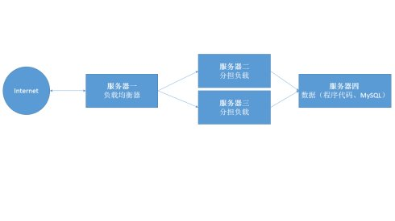

### 使用Nginx实现负载均衡 
#### 一、系统架构及环境准备
  

  - 服务器1  ip:192.168.1.1    软件:Nginx、php-fpm、pcre
  - 服务器2  ip:192.168.1.2    软件:Nginx、php-fpm、pcre
  - 服务器3  ip:192.168.1.3    软件:Nginx、php-fpm、pcre
  - 服务器4  ip:192.168.1.4    软件:MySQL、nfs、rpcbind

#### 二、原理
服务器一通过将Internet上对它的访问转发给服务器二和服务器三或更多服务器，以减轻自身负载；
为保证数据一致性，单独拿出一台服务器通过nfs将程序源代码共享出来，程序源代码中数据库只想服务器四的数据库，这样，服务器二和服务器三只要将程序源代码通过nfs挂载到网站主目录。

#### 三、实现
1. 软件安装并启动（nginx编译安装请到本文最后进行查阅），请自行对应上文中环境进行软件安装（rpm包安装或者源码安装均可，pcre用于使nginx支持正则表达式）
2. 服务器4配置：

  a. 配置nfs共享，将程序源代码copy到共享目录中，假设共享目录为/web，同时修改目录权限为777，操作如下：
  > \# chmod -R 777 /web

  b. 编辑/etc/exports文件添加如下内容实现程序源代码共享：
  > \> /web  *(rw,sync)

  c. 重启nfs服务
  > \# service nfs restart

  d. 以root身份登录MySQL创建用户并授权为可远程连接读写，MySQL内命令如下：

  > \> GRANT ALL ON *.* TO nginx@’%’ IDENTIFIED BY ‘123’;    
  > \> FLUSH PRIVILEGES;
  此处创建的用户名为nginx，密码为123，对数据库具有所有操作权限


3. 服务器二/三配置（服务器二和服务器三配置一样）

  a. 启动php-fpm
  > \# service php-fpm start

  b. 整合Nginx和PHP，对Nginx主配置文件如下部分进行修改：
  > location / {    
  >     root html;    
  >     index index.php index.html index.htm; # 注意，此处多了一个index.php    
  >   }

  c. 去掉以下行的注释    
  > location ~ .php$ {
  >   root html;
  >   fastcgi_pass 127.0.0.1:9000;
  >   fastcgi_index index.php;
  >   fastcgi_param SCRIPT_FILENAME /scripts$fastcgi_script_name;
  >   include fastcgi_params;
  > }


  d. 从服务器四挂载程序源代码到本机网站主目录下，此处的配置是上文第二段配置中的root字段，即nginx目录下的html目录
  > \# mount -t nfs 192.168.1.4:/web /usr/local/nginx/html/`

  e. 重新加载nginx配置文件
  > \# /usr/local/nginx/sbin/nginx -s reload


4. 服务器一配置
  清空nginx主配置文件并添加如下内容：
```
worker_processes 1;

events {
    worker_connections 1024;
}
http {
    upstream load_balance {
        ip_hash; # 会话保持
        server 192.168.1.2:80; # 后端的真实服务器
        server 192.168.1.3:80; # 后端的真实服务器 //后端的真实服务器
    }
    server {
        listen 80;
        server_name www.abc.com; # 网站域名
        location / {
        root html;
        index index.php index.html index.htm;
        proxy_pass http://load_balance; # 注意此处的load_balance应该和上文中upstream后面的字段保持相同，意思是将访问跳转到upstream后面配置的服务器上
        proxy_set_header Host $host;
        }
        error_page 500 502 503 504 /50x.html;
        location = /50x.html {
        root html;
        }
    }
}
```

#### 四、测试
通过上述四台主机上的任何一台的浏览器访问服务器一，重复多次，可分别查看到服务器二和服务器三的访问日志的访问情况，说明对服务器一的访问已经被均衡到后台的服务器二和服务器三上了。

#### 五、编译安装Nginx
1.准备软件包：nginx-1.4.4.tar.gz  pcre-8.10.tar.gz    
2.在上述软件包所在目录（假定为/tmp/soft/目录，下面用得到）下创建安装脚本内容如下：（假定脚本名为nginx_install.sh）
```
#!/bin/bash
# Filename: nginx_install.sh
# Function: install nginx

soft_dir=`pwd`

install_pcre(){
cd $soft_dir
tar xf pcre-8.10.tar.gz
cd pcre-8.10
./configure && make && make install
ldconfig
}
install_nginx(){
    useradd www
    cd $soft_dir

    tar xf nginx-1.4.4.tar.gz
    cd nginx-1.4.4
    ./configure —user=www \
    —group=www \
    —prefix=/usr/local/nginx-1.4.4 \
    —with-http_stub_status_module \
    —with-http_sub_module \
    —with-http_ssl_module \
    —with-pcre=/tmp/soft/pcre-8.10 #此处的用到上文提到的pcre的解压目录
    make && make install
    cd /usr/local/
    ln -s nginx-1.4.4/ nginx
}
install_pcre
install_nginx
```
3.给刚创建的脚本添加执行权限并以root用户身份执行
> \# chmod a+x nginx_install.sh
> \# ./nginx_install.sh

#### 六、总结
对于nginx来说，主要通过upstream模块来实现负载均衡，通过upstream将Internet上对服务器的访问分散到其它多台服务器上，虽然大家访问的是负载均衡服务器（服务器一），但实际的数据来源确是后台的多台服务器。这里要重点注意的就是数据的一致性，所有后台服务器（服务器二和服务器三）都需要使用相同的源程序和数据库，所以这里用到了服务器四提供nfs共享出网站源程序并通过服务器四的远程数据库保证了数据库一致性。
